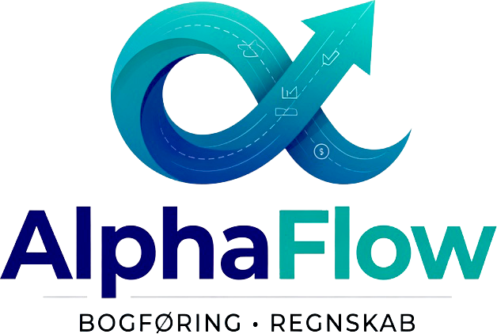

<p align="center">
  
</p>

<h1 align="center">AlphaFlow</h1>

<p align="center">
  <strong>Intelligent Accounting for Modern Businesses</strong><br/>
  A multi-tenant, AI-assisted web application for Danish small business bookkeeping — with full compliance under the Danish Bookkeeping Act (Bogføringsloven).
</p>

<p align="center">
  
  
  
  
  
  
  
  
</p>

---

## Overview

**AlphaFlow** (formerly AlphaAi Accounting) is a comprehensive, multi-tenant accounting web application built specifically for Danish small businesses. It provides a complete toolkit for managing company finances — from daily bookkeeping to annual year-end closing — all in one browser-based system. The application supports **multi-company management** with role-based access control, making it suitable for accountants managing multiple clients, businesses with multiple entities, and individual entrepreneurs.

The system covers the entire bookkeeping cycle — transaction registration, invoice management, double-entry journal posting, bank reconciliation, financial reporting, year-end closing, and regulatory exports (SAF-T / OIOUBL Peppol). All changes are automatically logged in an immutable audit trail, and data is only soft-deleted in compliance with Danish bookkeeping law.

The application is a **Progressive Web App (PWA)** installable on desktop and mobile. It supports **Danish and English** UI with ~320+ translation keys, light and dark themes, offline caching, and features an AI-assisted bank reconciliation engine.

---

## Who Is It For?

AlphaFlow is designed for **entrepreneurs, freelancers, small business owners, and accountants** who need a reliable accounting system without deep bookkeeping expertise. The UI is intuitive for beginners, while advanced features (double-entry posting, VAT codes, bank reconciliation) remain accessible.

The system is a **multi-tenant application** — each user can belong to multiple companies with different roles, and companies can invite team members. Whether you're a sole proprietor, an accountant managing 50 clients, or a business with employees who need access, AlphaFlow scales to your needs.

---

## Key Features

### Core Accounting
| Feature | Description |
|---|---|
| **Double-Entry Bookkeeping** | Full double-posting model with automatic debit/credit validation (±0.005 tolerance) as expected by Danish auditors and authorities |
| **Chart of Accounts** | Standard Danish chart with **38 accounts** following FSR standards (Foreningen af Statsautoriserede Revisorer) across 18 groups + custom account support |
| **Invoicing** | Create, send, and manage invoices with line items, automatic VAT calculation, sequence numbering (`PREFIX-YEAR-SEQ`), and PDF generation |
| **VAT Reporting** | Automatic calculation of output and input VAT with 10 Danish VAT codes (S25, S12, S0, SEU, K25, K12, K0, KEU, KUF, NONE) |
| **Customer & Supplier Management** | Create and maintain contacts with CVR numbers, contact details, and notes |
| **Financial Reporting** | Income statement, balance sheet, general ledger (trial balance), aging reports, and cash flow statement |
| **Export to Authorities** | Generate SAF-T files for the Danish Tax Authority (Skattestyrelsen) and OIOUBL/Peppol e-invoices with pre-validation |
| **Bank Reconciliation** | Import bank statements with 3-level automatic matching (rule-based, fuzzy, LLM-assisted) against posted entries |
| **Budgeting** | Plan your financial year with monthly budgets per account with actual-vs-budget comparison |
| **Year-End Closing** | Guided closing that resets income/expense accounts and locks all periods automatically |
| **Recurring Entries** | Automate fixed payments (rent, subscriptions, insurance) with templates and flexible frequencies (daily, weekly, monthly, quarterly, yearly) |
| **Receipt Scanning (OCR)** | Built-in receipt scanner using Tesseract.js — automatically extracts amount, date, and VAT percentage |
| **Multi-Currency** | Supports DKK, EUR, USD, GBP, SEK, and NOK with exchange rate tracking and DKK equivalents |
| **Backup** | Automatic backups with SHA-256 verification and up to 5-year retention per Bogføringsloven §15 |
| **Audit Trail** | Immutable audit log recording all changes with timestamp, user, IP, user-agent, and before/after values |

### Multi-Tenant & Collaboration
| Feature | Description |
|---|---|
| **Multi-Company** | Users can belong to multiple companies and switch between them instantly |
| **Role-Based Access Control** | 5 roles (Owner, Admin, Accountant, Viewer, Auditor) with 20+ granular permissions |
| **Team Invitations** | Email-based invitation system with expiring tokens and acceptance tracking |
| **Company Selector** | Quick-switch between companies from the sidebar |
| **Tenant Export/Import** | Export and import entire company datasets for migration |
| **Oversight Mode** | SuperDev users can oversee any tenant in read-only mode |

### Open Banking
| Feature | Description |
|---|---|
| **Bank Connections** | Connect to Danish banks (Nordea, Danske Bank, Jyske Bank) and Open Banking aggregators (Tink) |
| **OAuth2 + SCA Flow** | Full Strong Customer Authentication consent flow per provider |
| **Automatic Sync** | Scheduled transaction synchronization from connected bank accounts |
| **Sync History** | Detailed sync logs with success/partial/failed status tracking |
| **Demo Bank** | Built-in demo provider with realistic Danish transaction patterns for testing |

### AI-Assisted & Smart Features
| Feature | Description |
|---|---|
| **AI Bank Reconciliation** | 3-level matching engine: rule-based (exact), fuzzy (Levenshtein distance >50%), and LLM-assisted (via `z-ai-web-dev-sdk`) with confidence scoring |
| **Smart Transaction Categorization** | Keyword-based categorization engine mapping Danish/English terms to standard chart accounts (8 keyword groups with confidence scoring) |
| **Smart Matching** | Auto-post at >95% confidence, manual approval for 80–95%; fuzzy matches capped at 94% confidence |

### Dashboard & UX
| Feature | Description |
|---|---|
| **Customizable Dashboard** | **19 widgets** (KPIs, charts, forecasts, details) — reorderable, toggleable, per-company defaults (17 visible by default, 2 optional: Financial Health Detail, AI Categorization) |
| **Command Palette** | `Cmd+K` / `Ctrl+K` quick navigation to any page or action |
| **Keyboard Shortcuts** | `Alt+N` (new transaction), `Alt+I` (invoices), `Alt+R` (reports), `Alt+V` (VAT), `?` (help) |
| **Financial Health Score** | Composite score (0-100) analyzing revenue trends, expense ratios, VAT compliance, cash flow, and equity ratio |
| **Cash Flow Forecast** | Liquidity projection based on historical patterns |
| **Profit & Loss Waterfall** | Visual breakdown from gross profit to net result |
| **Expense Analysis** | Pie chart analysis of spending categories |
| **Budget vs Actual** | Monthly comparison of planned vs. actual amounts per account |
| **Notification Center** | In-app notifications for important events |
| **Onboarding Guide** | Step-by-step setup wizard with video tutorial for new users |
| **PWA Support** | Install on desktop/mobile, works offline with automatic caching |
| **Dark/Light Theme** | System-aware theme switching with manual override |
| **Danish/English UI** | Full bilingual interface (~320+ keys) with one-click switching |
| **Responsive Design** | Optimized for desktop, tablet, and mobile with bottom navigation and FAB |

---

## Danish Bookkeeping Law Compliance

AlphaFlow is developed with full compliance under the Danish **Bogføringslov** (Bookkeeping Act):

- **Audit Trail** (§10–12) — All changes recorded with timestamp, user, IP, user-agent, and field-level change details. The audit trail is immutable and can never be deleted or altered.
- **Soft Delete** (§4–8) — Financial entries and invoices are never physically deleted. They are marked as "cancelled" with a reason but remain in the system for audit trail purposes.
- **Fiscal Periods** — Periods can be locked to prevent posting to closed periods. Locking is rejected if drafts exist in the period.
- **Retention Requirement** (§15) — Automated backup scheduler (started via Node.js instrumentation) with SHA-256 verification and up to 60 months (5 years) retention policy.
- **Official Formats** — SAF-T (Danish Financial Schema v1.0) and OIOUBL/Peppol (BIS Billing 3.0) generated in formats required by Skattestyrelsen.

---

## Getting Started

### Prerequisites

- **[Bun](https://bun.sh/)** v1.3+ — sole runtime, package manager, and script runner
- **[Git](https://git-scm.com/)** — for cloning the repository

> **No other dependencies, environment variables, or configuration are needed.** The SQLite database is created automatically on first run.

### Quick Start

```bash
# 1. Clone repository
git clone https://github.com/Onezandzeroz/AlphaFlow-v.1.git
cd AlphaFlow-v.1

# 2. Install dependencies (generates Prisma Client automatically via postinstall)
bun install

# 3. Initialize the database
bun run db:push

# 4. Start the development server
bun run dev
```

The application is available at **http://localhost:3000**.

> **Note:** The dev server uses Webpack mode (`--webpack` flag) which is required for Prisma compatibility with Next.js 16. The custom `scripts/dev-server.ts` script handles port availability checks before starting.

### First Steps

After creating an account and logging in, the recommended setup order is:

1. **Set up company profile** — Go to "Settings" → "Company Profile" and fill in company name, address, CVR number, bank details, and invoice settings.
2. **Create chart of accounts** — Click "Chart of Accounts" → "Create standard Danish chart". This creates **38 standard accounts** following FSR standards.
3. **Add contacts** — Add your customers and suppliers under "Contacts". Contacts can be assigned types: Customer, Supplier, or Both.
4. **Record your first entry** — Create a transaction or journal entry and start bookkeeping.

You can also choose to **load demo data** from the dashboard. This creates realistic sample data for "Nordisk Erhverv ApS" — a 3-year rolling dataset with contacts, transactions, invoices, journal entries, budgets, periods, and the standard chart of accounts — so you can explore all features without entering real data.

---

## Module Overview

The application is organized into sections in the sidebar navigation. It uses an **SPA architecture** with client-side view switching (21 views) managed by React state and hash-based routing with History API support.

### Daily Operations

#### Dashboard — Your Command Center

The dashboard is your central overview, providing a quick snapshot of your company's financial health:

- **KPI Cards** — Revenue, net result, output VAT, input VAT, equity, and total assets.
- **Financial Health Score** — Composite score (0-100) analyzing revenue trends, expense ratios, VAT compliance, equity ratio, and cash flow.
- **P&L & Cash Position** — Combined indicator showing result and liquidity.
- **Monthly Comparison** — Period-over-period key metrics.
- **Quick Actions** — Direct shortcuts to create transactions, invoices, journal entries, VAT reports, and exports.
- **Revenue vs Expenses Chart** — Bar chart showing monthly income and expense trends.
- **VAT & Revenue Charts** — Combined VAT overview.
- **Net Result by Month** — Area chart tracking monthly profitability.
- **Expense Analysis** — Pie chart breakdown of spending by category.
- **P&L Waterfall** — Visual waterfall from gross profit to net result.
- **Cash Flow Forecast** — Liquidity projection based on historical patterns.
- **Invoice Overview** — Outstanding, paid, and overdue invoice summaries.
- **Budget vs Actual** — Monthly planned vs. actual comparison.
- **Recent Activity** — Latest journal entries with relative timestamps.
- **Most Active Accounts** — Top accounts by transaction volume.
- **SAF-T Export** — Quick export widget.
- **Widget Customization** — Toggle, reorder, and save 19 dashboard widgets. Defaults apply per company.
- **Onboarding Guide** — Step-by-step setup wizard with video tutorial for new users.
- **Optional Widgets** — Financial Health Detail and AI Categorization (hidden by default, can be enabled).

#### Transactions (Posteringer) — Record Sales and Purchases

- Create transactions with type (sale, purchase, salary, bank, Z-report, private, adjustment), date, amount, description, and VAT percentage.
- **Multi-currency** — Supports DKK, EUR, USD, GBP, SEK, NOK with exchange rate and DKK equivalent.
- **OCR receipt scanning** — Take a photo of a receipt; Tesseract.js extracts amount, date, and VAT percentage.
- Upload receipt images linked to transactions (attach/remove with confirmation).
- Transactions are never permanently deleted — marked as "cancelled" with reason per Bogføringsloven.
- Virtual transactions from invoice line items are merged into the transaction list.
- VAT totals sourced from dedicated VAT register API (single source of truth).
- Export all transactions to CSV with net/VAT/gross breakdown and totals.
- **Smart categorization** — Keyword-based suggestions mapping descriptions to standard chart accounts.
- Desktop: sortable/paginated table with filters. Mobile: card list with show-more pagination.

#### Invoicing — Create and Send Invoices

- Create invoices with line items (description, quantity, unit price, VAT percentage).
- Automatic subtotal, VAT amount, and total calculation.
- Sequential invoice numbering (`PREFIX-YEAR-SEQUENCE`).
- **Status workflow** — `DRAFT → SENT → PAID / CANCELLED`. Marking as "paid" auto-creates linked sale transactions.
- **PDF download** — Professional A4 PDF with company logo, bank details, and Danish labels.
- **OIOUBL/Peppol export** — Peppol BIS Billing 3.0 compatible e-invoice XML with pre-validation against 11 business rule categories.
- Filter by status to see which invoices are awaiting payment.

#### Contacts — Manage Customers and Suppliers

- Register name, CVR number, email, phone, address, city, postal code, and country.
- Assign contact type: Customer, Supplier, or Both.
- Search and filter by name, CVR number, or contact type.
- Contacts linked directly to invoices — customer info auto-fills.

#### Recurring Entries — Automate Fixed Payments

- Five frequencies: daily, weekly, monthly, quarterly, yearly.
- Status management: Active, Paused, or Completed.
- One-click execution creates a posted journal entry and advances the next execution date.

### Bookkeeping & Accounting

#### Journal Entries — Double-Entry Bookkeeping

The journal is the heart of your accounting. All financial transactions are recorded using double-entry bookkeeping:

- Each entry consists of at least two lines — one debit line and one credit line.
- System validates that debit and credit are balanced (±0.005 tolerance).
- **Three statuses**: Draft (freely editable), Posted (locked and included in reports), Cancelled (retained for audit trail).
- Each line can be assigned a VAT code for precise VAT tracking.
- Filter by status, date range, and keywords.

#### Chart of Accounts — The Foundation

- Standard Danish chart with **38 accounts** across 5 types (Asset, Liability, Equity, Revenue, Expense) and 18 groups.
- System accounts (marked "system") cannot be accidentally deleted.
- Add custom accounts with Danish and English names.

#### General Ledger — Account Balances

- Total debit, credit, and balance for each account.
- Grouped by account type (assets, liabilities, equity, revenue, expenses).
- Confirms double-entry balance (debit = credit).
- Filter by date range. Export to CSV.

#### Budgets — Plan Your Year

- Set expected amounts for each account distributed over 12 months.
- One active budget per financial year.
- Actual amounts calculated automatically from posted journal entries.
- Shows variance (budget vs. actual) per month and per account type.

### Reporting & Analysis

#### Reports — Income Statement and Balance Sheet

- **Income Statement** — Gross profit, operating result, and net result for a selected period. Uses AccountGroup-based aggregation from journal entry lines.
- **Balance Sheet** — Assets (Current + Fixed), Liabilities (Short + Long term), Equity (Share Capital + Retained Earnings + Current Year Result). Includes balance check.

#### VAT Report — Calculate and Report VAT

- Split into **output VAT** (S25, S12, S0, SEU) and **input VAT** (K25, K12, K0, KEU, KUF).
- Automatic net VAT calculation (output minus input).
- Filter by date range for your VAT reporting period.

#### Aging Reports — Follow Up on Unpaid Invoices

- Five aging buckets: 0–30, 31–60, 61–90, 91–120, and 120+ days.
- Supports both receivable and payable aging analysis.

#### Cash Flow Statement

Indirect method cash flow:
- **Operating activities** — money from core business operations.
- **Investing activities** — purchase/sale of long-term assets.
- **Financing activities** — loans, capital contributions, and dividends.

### Compliance & Closing

#### Bank Reconciliation

- Import bank statements with opening/closing balances and transaction lines.
- **3-Level Matching Engine**:
  1. **Rule-based**: Exact amount ±0.01 DKK, date ±3 days, reference match → confidence ≥0.60
  2. **Fuzzy**: Amount ±5 DKK or 5%, date ±7 days, description similarity >50% (Levenshtein distance with Danish stop words) → confidence capped at 0.94
  3. **LLM-assisted**: Powered by `z-ai-web-dev-sdk` with Danish-language prompts → confidence ≥0.80, auto-posts at >95%
- Manual matching for unmatched lines.
- Track status: Unmatched, Matched, Manual, AI Suggested.
- Batch processing: sorted by amount, 5 lines at a time for AI matching.

#### Open Banking

- **Bank Providers**: Demo Bank, Tink (Open Banking), Nordea, Danske Bank, Jyske Bank
- **OAuth2 + SCA** consent flow per provider
- Automatic scheduled synchronization
- Sync history with detailed status tracking (success/partial/failed)

#### Fiscal Periods — Lock and Unlock Periods

- Open period — free posting, editing, and cancellation.
- Closed period — no changes possible. Locking rejected if drafts exist.
- Calendar view of all months in the selected financial year.

#### Year-End Closing — Close the Financial Year

- **Preview** — Overview of the year's result and accounts to be closed.
- **Automatic closing entry** — Resets all revenue/expense accounts and posts the annual result to account 3300.
- **Automatic period locking** — Locks all 12 fiscal periods.

#### Exports — SAF-T and OIOUBL/Peppol

- **SAF-T** — Standard Audit File for Tax (Danish Financial Schema v1.0) with pre- and post-validation. Includes Header, MasterFiles, GeneralLedgerEntries, SourceDocuments, and Totals.
- **OIOUBL/Peppol** — E-invoices in UBL 2.1 format compatible with Peppol BIS Billing 3.0. Includes pre-validation against 11 business rule categories.
- **Tenant Export/Import** — Full company data export/import for migration.

### Maintenance & Security

#### Settings — Company Profile and Configuration

- Company name, address, phone, email, CVR number, company type (ApS, A/S, IVS, Enkeltmandsvirksomhed, Holding).
- Bank details (reg. number, account number, IBAN, bank address).
- Invoice settings (prefix, payment terms, logo, notes template).
- Team management (invite members, assign roles, remove).
- Oversight settings (for SuperDev users).
- Full data reset.

#### Backup — Create and Restore Backups

| Type | Retention | Coverage |
|---|---|---|
| Hourly | 24 backups | Last 24 hours |
| Daily | 30 backups | Last month |
| Weekly | 52 backups | Entire year |
| Monthly | 60 backups | 5 years (Bogføringsloven requirement) |

- Automated backup scheduler started via `instrumentation.node.ts` on server boot.
- Manual backups at any time.
- Restore from any backup with automatic pre-restore safety backup.
- All backups verified with SHA-256 checksum.
- Download backup file for extra security.

#### Audit Trail — Everything Logged Automatically

Immutable log of all system actions:
- **13+ action types**: Creation, update, cancellation, login, logout, deletion attempt, backup, etc.
- Before and after values for all changes.
- Filter by action type, entity type, and date range.
- Can never be deleted or modified — required by Danish Bookkeeping Act.

---

## Demo Mode

The application includes a fully-featured **Demo Mode**:

- **Enter Demo Mode** — Seeds realistic sample data for a demo company ("Nordisk Erhverv ApS", an IT consulting company in Copenhagen) with a **3-year rolling dataset**: 4 customers, 4 suppliers, ~36+ invoices/month scaling across 3 years, salary/rent/telecom/insurance/depreciation journal entries, quarterly VAT settlements, budgets, and the full 38-account chart of accounts.
- **Exit Demo Mode** — Returns to your own company data.
- **Data Isolation** — Demo and live data are fully separated via `tenantFilter()` in `rbac.ts`. Each company has its own isolated dataset.
- **SuperDev Access** — SuperDev users can edit the demo company data (full write access), while regular users see it read-only.

---

## Architecture

The application is a **single-page application** (SPA) served from one route (`/`). Client-side navigation is managed by React state (`currentView`) with hash-based routing and History API support. The SPA renders 21 distinct views without page reloads.

```
┌──────────────────────────────────────────────────────────────────┐
│                      Browser (PWA)                                │
│  ┌──────────┐  ┌──────────┐  ┌────────────────────────────┐     │
│  │ Zustand   │  │ React    │  │ shadcn/ui Components       │     │
│  │ Stores    │  │ State    │  │ (48 Radix + TW4 based)     │     │
│  │ (auth,    │  │ (fetch)  │  │                            │     │
│  │ sidebar,  │  │          │  │ Recharts                   │     │
│  │ language, │  │          │  │                            │     │
│  │ scanner,  │  │          │  │ Mobile FAB + Bottom Nav    │     │
│  │ company,  │  │          │  │ Command Palette (Cmd+K)    │     │
│  │ widgets)  │  │          │  │ Keyboard Shortcuts         │     │
│  └────┬─────┘  └────┬─────┘  └────────────────────────────┘     │
│       │              │                                            │
├───────┼──────────────┼────────────────────────────────────────────┤
│       │         REST API (68 route files)                         │
│  ┌────▼──────────────▼─────────────────────────────────────┐     │
│  │  Next.js 16 API Routes (App Router, Webpack mode)        │     │
│  │  ┌──────────┐ ┌──────────┐ ┌───────────────────────┐    │     │
│  │  │ Session  │ │ RBAC     │ │ Audit Logger           │    │     │
│  │  │ Auth     │ │ (5 roles,│ │ (Immutable)            │    │     │
│  │  │ (7-day   │ │ 20+ perms│ │                        │    │     │
│  │  │ sliding) │ │          │ │ Rate Limiter           │    │     │
│  │  └────┬─────┘ └──────────┘ └───────────────────────┘    │     │
│  └──────┼──────────────────────────────────────────────────┘     │
│         │                                                          │
│  ┌──────▼──────────────────────────────────────────────────┐     │
│  │  Prisma ORM (SQLite)                                    │     │
│  │  22 models · 15 enums · Multi-tenant company isolation  │     │
│  └─────────────────────────────────────────────────────────┘     │
└──────────────────────────────────────────────────────────────────┘
```

### Technology Stack

| Layer | Technology | Version | Purpose |
|---|---|---|---|
| **Runtime** | [Bun](https://bun.sh/) | 1.3+ | JavaScript runtime, package manager, script runner |
| **Framework** | [Next.js](https://nextjs.org/) | 16.1 | React SSR/SSG framework (App Router, Webpack mode) |
| **UI Library** | [React](https://react.dev/) | 19 | Component framework |
| **Language** | [TypeScript](https://www.typescriptlang.org/) | 5 | Static type checking |
| **Styling** | [Tailwind CSS](https://tailwindcss.com/) | 4 | Utility-first CSS |
| **Components** | [shadcn/ui](https://ui.shadcn.com/) | new-york | 48 Radix UI-based components |
| **Icons** | [Lucide React](https://lucide.dev/) | — | 60+ icons |
| **State** | [Zustand](https://zustand.docs.pmnd.rs/) | 5 | Client-side state (auth, sidebar, language, company, scanner, widgets) |
| **Forms** | [React Hook Form](https://react-hook-form.com/) + [Zod](https://zod.dev/) | 7 / 4 | Form handling & validation |
| **Database** | [SQLite](https://sqlite.org/) via [Prisma](https://www.prisma.io/) | 6.19 | File-based relational database |
| **Charts** | [Recharts](https://recharts.org/) | 2.15 | Data visualization |
| **PDF** | [pdf-lib](https://pdf-lib.js.org/) | 1.17 | Server-side invoice PDF generation |
| **OCR** | [Tesseract.js](https://tesseract.projectnaptha.com/) | 7 | Client-side receipt scanning |
| **XML** | [xmlbuilder2](https://github.com/oozcitak/xmlbuilder2) | 4 | SAF-T and OIOUBL XML generation |
| **AI SDK** | [z-ai-web-dev-sdk](https://www.npmjs.com/package/z-ai-web-dev-sdk) | 0.0.17 | LLM-powered bank reconciliation matching (level 3) |
| **Archive** | [Archiver](https://www.npmjs.com/package/archiver) | 7 | ZIP backup creation |
| **Dark Mode** | [next-themes](https://github.com/pacocoursey/next-themes) | 0.4 | Theme management |
| **Dates** | [date-fns](https://date-fns.org/) + [react-day-picker](https://daypicker.dev/) | 4 / 9 | Date utilities & pickers |
| **Process Mgmt** | [PM2](https://pm2.keymetrics.io/) | — | Production process management |
| **Reverse Proxy** | [Caddy](https://caddyserver.com/) | — | HTTPS termination & routing |

### Database Schema

The SQLite database contains **22 models** and **15 enums**:

**Core Models:** `User`, `Session`, `Company`, `UserCompany`, `Invitation`, `Account`, `Transaction`, `JournalEntry`, `JournalEntryLine`, `Invoice`, `Contact`

**Compliance & Reporting Models:** `FiscalPeriod`, `BankStatement`, `BankStatementLine`, `Document`, `AuditLog`, `Backup`, `RecurringEntry`, `Budget`, `BudgetEntry`, `BankConnection`, `BankConnectionSync`

**Key Enums:** `TransactionType` (7 values), `InvoiceStatus` (4), `AccountType` (5), `AccountGroup` (18), `JournalEntryStatus` (3), `ContactType` (3), `PeriodStatus` (2), `VATCode` (10), `RecurringFrequency` (5), `RecurringStatus` (3), `ReconciliationStatus` (4), `BankConnectionStatus` (5), `SyncStatus` (4), `CompanyRole` (5), `InvitationStatus` (4).

### API Overview

The application exposes **68 API route files** under `/api/`. All mutating endpoints require session-based authentication and generate audit log entries. The system uses `tenantFilter()` from `rbac.ts` for multi-tenant data isolation on all queries.

| Category | Endpoints | Key Operations |
|---|---|---|
| **Authentication** | `auth/login`, `auth/register`, `auth/me`, `auth/logout`, `auth/delete-account`, `auth/promote-superdev` | Session management, rate-limited login/register (5/min per IP), SuperDev promotion |
| **Companies** | `companies`, `companies/[id]/invitations`, `companies/[id]/members/[userId]` | Multi-tenant company CRUD, team management, invitation system |
| **Company Switch** | `company/switch`, `company` | Active company switching, company settings CRUD |
| **Invitations** | `invitations/accept`, `invitations/verify` | Email invitation acceptance flow |
| **Accounts** | `accounts`, `accounts/[id]`, `accounts/seed`, `expense-categories` | CRUD + standard Danish chart seeding + expense analysis |
| **Transactions** | `transactions`, `transactions/export`, `transactions/export-peppol`, `transactions/recent-descriptions` | CRUD + CSV export + OIOUBL export + description autocomplete |
| **Journal Entries** | `journal-entries`, `journal-entries/[id]` | Double-entry CRUD with balance validation |
| **Invoices** | `invoices`, `invoices/[id]`, `invoices/[id]/pdf`, `invoices/[id]/oioubl`, `invoices/[id]/oioubl/validate` | Invoice lifecycle + PDF + Peppol + validation |
| **Contacts** | `contacts`, `contacts/[id]` | Customer/supplier address book |
| **Reports** | `reports`, `ledger`, `vat-register`, `cash-flow`, `cash-flow-forecast`, `profit-loss`, `aging-reports`, `financial-health`, `account-trend` | Full financial reporting suite |
| **Bank Reconciliation** | `bank-reconciliation` | Statement import, auto-match, manual match, AI-assisted matching |
| **Bank Connections** | `bank-connections`, `bank-connections/[id]`, `bank-connections/[id]/consent`, `bank-connections/[id]/sync`, `bank-connections/consent-callback` | Open Banking integration |
| **Fiscal Periods** | `fiscal-periods`, `fiscal-periods/[id]` | Annual periods, lock/unlock months |
| **Budgets** | `budgets`, `budget-vs-actual` | Annual budget CRUD with actual comparison |
| **Recurring** | `recurring-entries`, `recurring-entries/execute` | Template management and one-click execution |
| **Year-End** | `year-end-closing` | Preview and execute with auto period locking |
| **Exports** | `export-saft`, `export-tenant`, `import-tenant` | SAF-T XML, full tenant migration |
| **Smart Features** | `ai-categorize` | Keyword-based transaction categorization (8 keyword groups) |
| **Documents** | `documents`, `documents/[id]`, `documents/serve/[...path]` | Upload, serve, delete with path traversal protection |
| **Audit** | `audit-logs` | Paginated, filterable audit trail |
| **Oversight** | `oversight/switch`, `oversight/clear`, `oversight/tenants` | SuperDev cross-tenant read-only access |
| **Widget Settings** | `widget-settings` | Dashboard widget visibility and ordering |
| **User** | `user/preferences` | Sidebar preferences sync |
| **Demo** | `demo-mode`, `demo-seed` | Demo mode toggle and data seeding |
| **Receipts** | `receipts/[...path]` | Receipt image serving |

### Role-Based Access Control (RBAC)

Five roles with hierarchical permissions:

| Role | Level | Description |
|---|---|---|
| **OWNER** | 5 | Full control + can transfer ownership, manage members |
| **ADMIN** | 4 | Full control except ownership transfer and OWNER removal |
| **ACCOUNTANT** | 3 | Can create/edit all accounting data, cannot manage members |
| **VIEWER** | 2 | Read-only access to all accounting data |
| **AUDITOR** | 1 | Read-only + can export reports and run audits |

20+ granular permissions across 8 categories: company settings, member management, accounting data CRUD (read/create/edit/cancel/delete), reports (view/export/SAFT), period management (close/open/year-end), banking (connect/sync), and backups (create/restore).

**Special modes:**
- **SuperDev** — Full OWNER permissions in own company + read-only cross-tenant oversight
- **Oversight Mode** — SuperDev viewing another tenant; all mutations blocked
- **Demo Company Protection** — All non-SuperDev writes blocked on demo company

---

## Project Structure

```
AlphaFlow-v.1/
├── prisma/
│   ├── schema.prisma              # 22 models, 15 enums (SQLite)
│   └── db/custom.db               # Database file (auto-created, git-ignored)
├── public/
│   ├── logo.svg / logo.png        # Brand logos (multiple variants)
│   ├── logo-clean.png             # Login/dashboard variant
│   ├── logo-cleanBack.png         # Dark variant
│   ├── logo-notext.png            # Sidebar variant
│   ├── logo-white.png             # Light-on-dark variant
│   ├── favicon.png                # App icon
│   ├── apple-touch-icon.png       # iOS app icon
│   ├── manifest.json              # PWA manifest (Danish, standalone)
│   ├── sw.js                      # Service worker (3-layer caching)
│   ├── VidClips/Onboarding/       # Onboarding images & video (mp4 + png)
│   └── robots.txt                 # Crawler policy
├── scripts/
│   ├── dev-server.ts              # Smart dev starter (port check + Webpack mode)
│   └── kill-port.ts               # Cross-platform port killer
├── src/
│   ├── app/
│   │   ├── page.tsx               # Root SPA page (auth gate + 21-view router)
│   │   ├── layout.tsx             # Root layout (fonts, PWA, toaster, theme)
│   │   ├── globals.css            # Theme, component styles, dark mode, animations
│   │   └── api/                   # 68 API route handlers
│   │       ├── auth/              # Login, register, me, logout, delete, promote
│   │       ├── accounts/          # CRUD + seed + expense categories
│   │       ├── transactions/      # CRUD + CSV/Peppol export + descriptions
│   │       ├── journal-entries/   # Double-entry CRUD
│   │       ├── invoices/          # CRUD + PDF + OIOUBL + validate
│   │       ├── contacts/          # Customer/supplier CRUD
│   │       ├── companies/         # Multi-tenant CRUD + invitations + members
│   │       ├── company/           # Company settings + switch
│   │       ├── invitations/       # Accept + verify
│   │       ├── oversight/         # SuperDev cross-tenant access
│   │       ├── reports/           # Income statement + balance sheet
│   │       ├── ledger/            # General ledger
│   │       ├── bank-reconciliation/ # Import + auto-match + manual match + AI
│   │       ├── bank-connections/  # Open Banking (5 providers)
│   │       ├── cash-flow/         # Cash flow statement
│   │       ├── cash-flow-forecast/ # Liquidity projection
│   │       ├── profit-loss/       # P&L waterfall data
│   │       ├── vat-register/      # Danish VAT report
│   │       ├── aging-reports/     # Aging analysis
│   │       ├── financial-health/  # Health score calculation
│   │       ├── account-trend/     # Account trend analysis
│   │       ├── budget-vs-actual/  # Budget comparison
│   │       ├── expense-categories/ # Expense categorization
│   │       ├── export-saft/       # SAF-T XML
│   │       ├── export-tenant/     # Full tenant export
│   │       ├── import-tenant/     # Full tenant import
│   │       ├── fiscal-periods/    # Period management + locking
│   │       ├── budgets/           # Budgets with variance
│   │       ├── recurring-entries/ # Recurring entries + execute
│   │       ├── year-end-closing/  # Year-end closing
│   │       ├── ai-categorize/     # Smart keyword-based categorization
│   │       ├── widget-settings/   # Dashboard widget config
│   │       ├── audit-logs/        # Audit trail
│   │       ├── documents/         # Document handling
│   │       ├── demo-mode/         # Demo mode toggle
│   │       ├── demo-seed/         # Demo data seeding (3-year dataset)
│   │       └── user/              # User preferences
│   ├── components/
│   │   ├── auth/                  # Login and registration forms
│   │   ├── dashboard/             # Dashboard with KPIs, charts, 19 widgets
│   │   ├── layout/                # AppLayout (sidebar, dark mode, mobile, company selector)
│   │   ├── transactions/          # Posteringer page, transaction form, receipt scanner
│   │   ├── transaction/           # Add transaction form, categorization badge
│   │   ├── invoices/              # Invoice management
│   │   ├── chart-of-accounts/     # Chart of accounts
│   │   ├── journal/               # Journal entries
│   │   ├── contacts/              # Contacts
│   │   ├── ledger/                # General ledger
│   │   ├── reports/               # Reports
│   │   ├── vat-report/            # VAT register
│   │   ├── bank-reconciliation/   # Bank reconciliation + open banking section
│   │   ├── cash-flow/             # Cash flow statement
│   │   ├── cash-flow-forecast/    # Cash flow forecast widget
│   │   ├── profit-loss-waterfall/ # P&L waterfall chart
│   │   ├── expense-analysis/      # Expense pie chart
│   │   ├── budget-vs-actual/      # Budget comparison widget
│   │   ├── financial-health/      # Financial health score widget
│   │   ├── aging-reports/         # Aging reports
│   │   ├── exports/               # Export page
│   │   ├── fiscal-periods/        # Period management
│   │   ├── budget/                # Budgets
│   │   ├── recurring-entries/     # Recurring entries
│   │   ├── year-end-closing/      # Year-end closing
│   │   ├── backup/                # Backup
│   │   ├── audit-log/             # Audit trail
│   │   ├── settings/              # Settings, company settings, team management, oversight
│   │   ├── pwa/                   # PWA registration + offline notice + install prompt
│   │   ├── providers/             # Theme provider
│   │   ├── shared/                # PageHeader, StatsCard, DateRangeFilter, MobileFilterDropdown
│   │   ├── command-palette.tsx    # Cmd+K command palette
│   │   ├── keyboard-shortcuts-modal.tsx # Keyboard shortcuts help
│   │   ├── mobile-bottom-nav.tsx  # Mobile bottom navigation
│   │   ├── mobile-fab.tsx         # Mobile floating action button
│   │   ├── notification-center.tsx # Notification system
│   │   └── ui/                    # 48 shadcn/ui components (new-york style)
│   ├── lib/
│   │   ├── db.ts                  # Prisma client singleton (SQLite path resolution)
│   │   ├── session.ts             # Cryptographic session management (7-day sliding, cookie + Bearer)
│   │   ├── password.ts            # bcrypt hashing (12 rounds, legacy auto-rehash)
│   │   ├── rate-limit.ts          # In-memory rate limiter (per-key sliding window)
│   │   ├── rbac.ts                # Role-based access control (5 roles, 20+ perms, tenantFilter)
│   │   ├── audit.ts               # Immutable audit log (CREATE/UPDATE/CANCEL/DELETE_ATTEMPT)
│   │   ├── auth-store.ts          # Zustand auth state + company switching
│   │   ├── company-store.ts       # Company context store
│   │   ├── sidebar-store.ts       # Sidebar collapse/expand preferences
│   │   ├── language-store.ts      # Language preference (DA/EN)
│   │   ├── scanner-store.ts       # Receipt scanner UI state
│   │   ├── dashboard-widgets.ts   # Dashboard widget customization hook (Zustand)
│   │   ├── dashboard-widget-definitions.ts # 19 widget definitions (17 visible + 2 optional)
│   │   ├── translations.ts        # ~320+ bilingual translations (DA/EN) + currency/date formatters
│   │   ├── use-translation.ts     # Translation hook (t, tc, td, tm helpers)
│   │   ├── use-permissions.ts     # Client-side permission hook
│   │   ├── currency-utils.ts      # Multi-currency formatting (DKK, EUR, USD, GBP, SEK, NOK)
│   │   ├── seed-chart-of-accounts.ts # 38-account FSR Standardkontoplan seeder
│   │   ├── seed-demo-company.ts   # 3-year demo company seeder ("Nordisk Erhverv ApS")
│   │   ├── oioubl-generator.ts    # Peppol XML generator (UBL 2.1)
│   │   ├── oioubl-validator.ts    # OIOUBL validator (11 rule categories)
│   │   ├── saft-validator.ts      # SAF-T validator (Danish Financial Schema v1.0)
│   │   ├── pdf-generator.ts       # A4 invoice PDF generator
│   │   ├── backup-engine.ts       # Backup/restore with SHA-256 verification
│   │   ├── backup-scheduler.ts    # Automated backup scheduling (hourly/daily/weekly/monthly)
│   │   ├── matching-engine.ts     # 3-level bank reconciliation matching engine
│   │   ├── bank-providers.ts      # Open Banking abstraction (5 providers + Demo Bank)
│   │   ├── ocr-utils.ts           # Tesseract.js receipt scanner utilities
│   │   ├── demo-filter.ts         # Demo data isolation helper (deprecated, delegates to rbac)
│   │   ├── logger.ts              # Structured logging (dev=debug, prod=warn+)
│   │   ├── port-utils.ts          # Port availability scanning
│   │   └── utils.ts               # General utilities (cn, formatCurrency, etc.)
│   ├── hooks/                     # React hooks (use-mobile, use-toast)
│   ├── instrumentation.ts         # Edge runtime instrumentation (empty shell)
│   └── instrumentation.node.ts    # Node.js instrumentation (starts/stops backup scheduler)
├── docs/
│   └── MULTI_TENANT_PLAN.md       # Multi-tenant architecture planning doc
├── mini-services/                 # Mini services directory (reserved for future use)
├── examples/
│   └── websocket/                 # WebSocket demo reference
├── Caddyfile                      # Reverse proxy (dev + production config)
├── ecosystem.config.js            # PM2 configuration
├── package.json                   # Dependencies and scripts
├── bun.lock                       # Lock file
├── tsconfig.json                  # TypeScript configuration
├── components.json                # shadcn/ui configuration (new-york, lucide, neutral)
├── eslint.config.mjs              # ESLint configuration
├── next.config.ts                 # Next.js config (reactStrictMode, Webpack)
├── postcss.config.mjs             # PostCSS configuration
├── daemon.sh                      # Background daemon script
├── keep-alive.sh                  # Process keep-alive script
├── run-dev.sh                     # Dev runner script
├── start-dev.sh                   # Dev start script
├── start-dev-daemon.sh            # Dev daemon script
├── start-server.sh                # Server start script
└── STARTUP.md                     # Deployment guide (local, production, cloud VPS)
```

---

## Available Scripts

| Command | Description |
|---|---|
| `bun run dev` | Start dev server (port 3000, Webpack mode, port check) |
| `bun run dev:direct` | Start dev server without port check |
| `bun run build` | Create optimized production build |
| `bun run start` | Start production server (after `build`) |
| `bun run start:pm2` | Start via PM2 process management (VPS) |
| `bun run lint` | Run ESLint |
| `bun run db:push` | Sync Prisma schema to database |
| `bun run db:generate` | Regenerate Prisma Client types |
| `bun run db:reset` | Fully reset database (**deletes all data**) |
| `bun run kill-port [port]` | Kill process on a port (default: 3000) |
| `bun run ports` | Scan port availability for 3000–3009 |

### Production Deployment

For cloud VPS with **Caddy** (auto-HTTPS) and **PM2** (process management):

```bash
bun run build
bun run db:push
bun run start:pm2
# Configure Caddy (see Caddyfile)
sudo caddy reload --config /path/to/Caddyfile
```

See [`STARTUP.md`](./STARTUP.md) for detailed deployment instructions.

---

## Regulatory Compliance

| Regulation | Implementation |
|---|---|
| **Bogføringsloven §4–8** (Registration) | Immutable audit trail, soft-delete cancellation, no hard deletion |
| **Bogføringsloven §10–12** (Audit Log) | All mutations logged with user, timestamp, IP, user-agent, and field-level changes |
| **Bogføringsloven §15** (Retention) | Automated backup scheduler with SHA-256 verification, 5-year retention policy |
| **Danish VAT Codes** | 10 codes: S25, S12, S0, SEU (output) and K25, K12, K0, KEU, KUF (input) + NONE |
| **FSR Chart of Accounts** | 38 standard accounts across 18 account groups (Standardkontoplan) |
| **SAF-T Denmark** | Danish Financial Schema v1.0 XML with pre- and post-validation |
| **OIOUBL / Peppol** | Peppol BIS Billing 3.0 (UBL 2.1) with 11-category validation |
| **Year-End Closing** | Automatic reset of income/expense accounts with posting to account 3300 |

---

## FAQ

**Can I use the system without bookkeeping knowledge?**
Yes, the system is designed to be user-friendly. The standard chart of accounts can be created with one click, and most modules are intuitive. However, double-entry bookkeeping — the core feature — requires a basic understanding of debit and credit. The system helps validate balance, but it's recommended to understand the principles or consult an accountant.

**Can I switch languages?**
Yes, switch between Danish and English at any time via the language button in the sidebar. The choice is saved automatically. The system has ~320+ translation keys covering all UI text.

**Where is my data stored?**
Data is stored in a SQLite database on the server (`prisma/db/custom.db`). The system creates automatic backups via the backup scheduler started on server boot. If you manage the server yourself, backup files should be stored securely — preferably on a separate location.

**What is SAF-T, and do I need it?**
SAF-T (Standard Audit File for Tax) is a format that Skattestyrelsen can request. Whether your business is subject to the requirement depends on size and type — ask your accountant.

**Can I export to other formats?**
Yes — CSV (Excel/Google Sheets), SAF-T XML (Skattestyrelsen), and OIOUBL/Peppol (electronic invoices). Full tenant export/import is also available for migration.

**What happens if I accidentally delete an entry?**
Entries are never permanently deleted. They are marked as "Cancelled" with a reason, remain in the system for audit trail purposes, and can be filtered out from views. This is required by Danish Bookkeeping Act (Bogføringsloven).

**How does the AI bank reconciliation work?**
The reconciliation engine uses a 3-level approach: (1) rule-based exact matching for high-confidence pairs, (2) fuzzy matching using Levenshtein distance with Danish stop word handling for partial matches, and (3) LLM-assisted matching via `z-ai-web-dev-sdk` for complex cases. Matches above 95% confidence are auto-posted; 80–95% require manual approval.

**Is the transaction categorization really AI-powered?**
The categorization system uses a keyword-based engine that maps Danish and English terms (e.g., "husleje", "løn", "forsikring") to standard chart accounts. It provides confidence scores and supports batch processing. The LLM (`z-ai-web-dev-sdk`) is used specifically for bank reconciliation matching, not for categorization.

---

## Changelog — Key Differences from Previous README

This README was updated after a full codebase audit. Here are the corrections and additions:

| Item | Previous | Current (Actual) |
|---|---|---|
| Chart of Accounts | 35 accounts | **38 accounts** (verified in `seed-chart-of-accounts.ts`) |
| Dashboard Widgets | 17 widgets | **19 widget definitions** (17 visible + 2 optional: Financial Health Detail, AI Categorization) |
| API Endpoints | 70 endpoints | **68 route files** (verified count of all `route.ts` files) |
| AI Categorization | "AI-powered using LLM" | **Keyword-based engine** (8 Danish/English keyword groups, NOT LLM) |
| AI SDK Usage | "bank reconciliation and categorization" | **Bank reconciliation only** (level 3 matching) |
| Fuzzy Match Threshold | "description similarity >70%" | **">50%"** (verified in `matching-engine.ts`) |
| Demo Data | Generic description | **3-year rolling dataset** for "Nordisk Erhverv ApS" (4 customers, 4 suppliers, ~36+ invoices/month) |
| Demo Filter | Active system | **Deprecated** — now delegates to `tenantFilter()` from `rbac.ts` |
| Translation Coverage | Not quantified | **~320+ keys** covering all UI text |
| Backup Scheduler | Not detailed | **Auto-started via `instrumentation.node.ts`** on server boot |
| Login Rate Limiting | Not specified | **5 attempts per minute per IP** |
| Company Types | Not listed | **ApS, A/S, IVS, Enkeltmandsvirksomhed, Holding, Other** |
| Password Hashing | Not detailed | **bcrypt, 12 rounds, legacy auto-rehash** |
| Session Management | "7-day sliding" | **Cookie + Bearer auth, 32-byte hex token, 7-day sliding expiry** |
| SPA Views | Not counted | **21 distinct views** with hash-based routing and History API |

---

*Last updated: April 2025 — Based on full source code audit of commit from `main` branch.*
